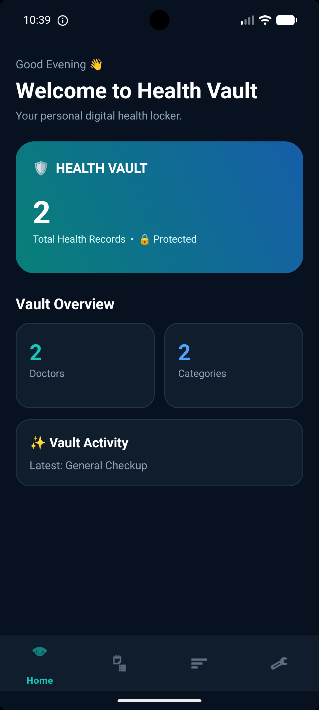
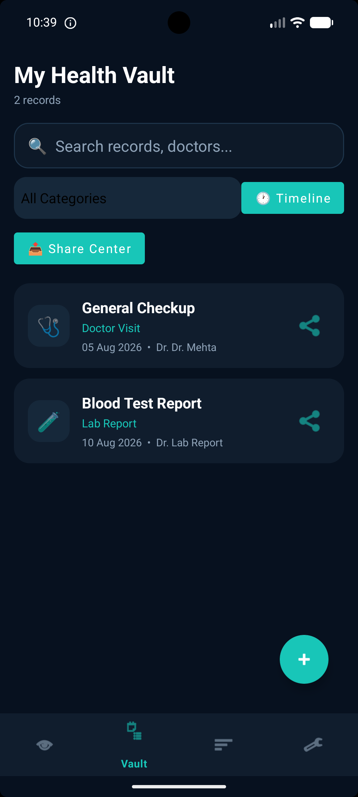
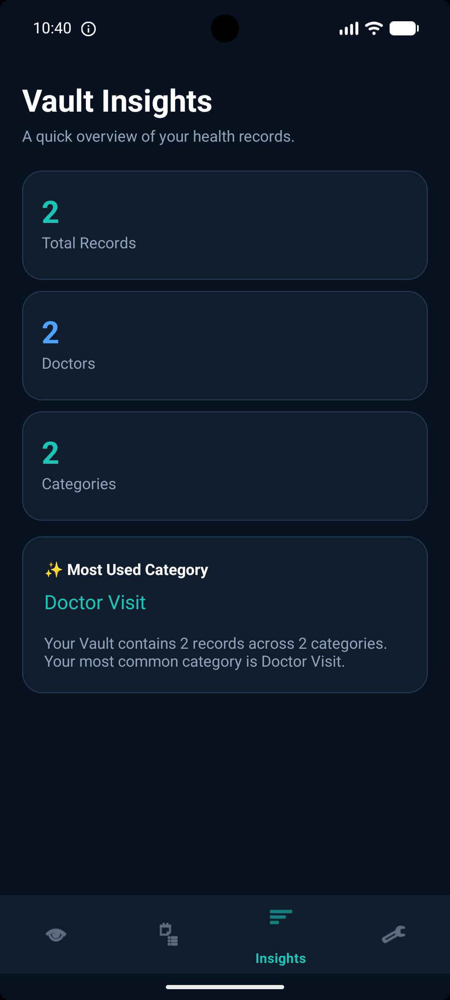
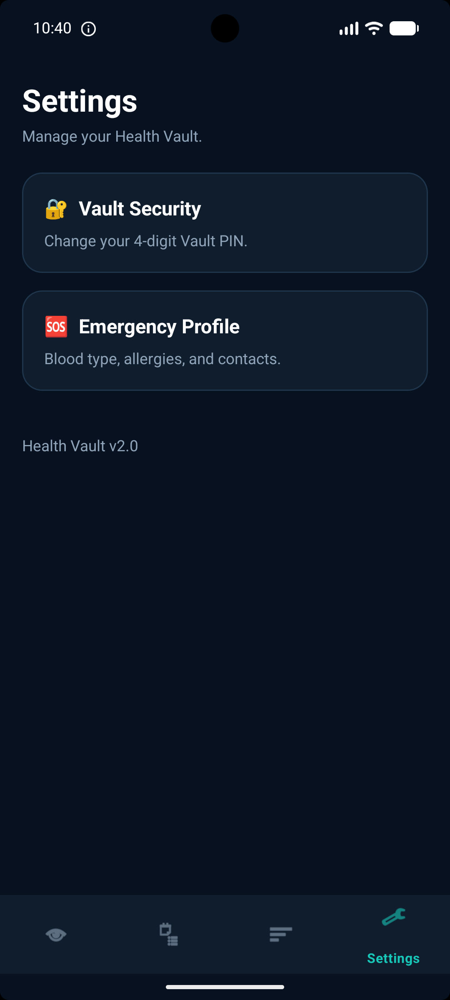

<p align="center">
  
  
  
  
  
</p>

<h1 align="center">🏥 Health Vault</h1>

<p align="center">
  <strong>Your Personal, Offline-First Digital Health Locker</strong><br/>
  <em>Privacy-focused medical record management for Android — no cloud, no compromises.</em>
</p>

<p align="center">
  <b>👨‍💻 Developer:</b> Nishit Patel<br/>
  <b>🎓 Enrollment No:</b> 24012011115
</p>

<p align="center">
  <a href="#-key-features">Features</a> •
  <a href="#-screenshots">Screenshots</a> •
  <a href="#-architecture">Architecture</a> •
  <a href="#-tech-stack">Tech Stack</a> •
  <a href="#-project-structure">Project Structure</a> •
  <a href="#-challenges--solutions">Challenges</a> •
  <a href="#-getting-started">Get Started</a>
</p>

---

## 📋 Overview

**Health Vault** is a comprehensive personal health management application for Android, designed with a relentless focus on **privacy**, **security**, and **data portability**. It allows users to maintain a secure digital record of their entire medical history and provides critical, life-saving information during emergencies — all without ever sending data to the cloud.

### 🎯 Core Principles

| Principle | Description |
|:---:|---|
| 🔒 **Privacy First** | All sensitive medical data is stored strictly locally on the device using an encrypted database. Zero cloud dependency. |
| 📤 **Data Portability** | Share medical history with healthcare providers or family members in a clear, structured format via any messaging app. |
| 🚨 **Emergency Readiness** | Instant, offline access to life-saving information (Blood Type, Allergies, Emergency Contacts) for first responders. |
| 💪 **User Empowerment** | Replace traditional paper records with a modern, intuitive digital interface for managing long-term health history. |

---

## ✨ Key Features

### 1. 🗄️ Secure Digital Vault
- **Local Record Storage** — A robust Room-based database to store lab reports, vaccinations, prescriptions, and doctor visit summaries.
- **Smart Categorization** — Organize records by type (Lab Report, Doctor Visit, Prescription, etc.), date, and doctor for instant retrieval.
- **Search & Filter** — Full-text search across records, doctors, and categories with real-time results.
- **Timeline View** — Chronological ordering of all medical events for a clear health timeline.

### 2. 📤 Advanced Share Center (Health Vault Share)
- **Custom "Share Packs"** — Generates professionally formatted ASCII-text summaries of selected health records.
- **Bulk & Individual Sharing** — Share a single specific record or generate a comprehensive report of your entire history.
- **Universal Compatibility** — Works seamlessly with the Android Share Sheet to send data via WhatsApp, Email, SMS, or any messaging app.

### 3. 🆘 Emergency Profile (Medical ID)
- **Critical Data Storage** — Dedicated section for vital stats: Blood Type, Allergies, Chronic Medications, and Emergency Contacts.
- **Instant Access** — Designed for rapid viewing during medical emergencies without navigating through complex menus.

### 4. 🔐 Biometric Security
- **Identity Gating** — Optional biometric lock (Fingerprint/Face Unlock) to prevent unauthorized access to health data.
- **PIN Protection** — 4-digit Vault PIN as an additional security layer.
- **Smart Detection** — Automatically detects device capabilities to provide a seamless experience on both high-end and legacy devices.

### 5. 📊 Health Insights
- **Data Trends** — Visual summaries of health milestones and record frequencies.
- **Category Breakdown** — See distribution across record types with most-used category highlights.
- **Home Dashboard** — A high-level overview of the vault's status with quick-action buttons.

---

## 📱 Screenshots

<p align="center">
  
  &nbsp;&nbsp;&nbsp;
  
  &nbsp;&nbsp;&nbsp;
  
  &nbsp;&nbsp;&nbsp;
  
</p>

<p align="center">
  <sub><b>From left to right:</b> Home Dashboard • Vault Records • Health Insights • Settings & Emergency Profile</sub>
</p>

---

## 🏗️ Architecture

Health Vault follows the **MVVM (Model-View-ViewModel)** architecture pattern, ensuring a clean separation of concerns, testability, and maintainability.

```
┌─────────────────────────────────────────────────────────┐
│                      UI Layer                           │
│  ┌──────────┐ ┌──────────┐ ┌──────────┐ ┌───────────┐  │
│  │   Home   │ │  Vault   │ │ Insights │ │ Settings  │  │
│  │ Fragment │ │ Fragment │ │ Fragment │ │ Fragment  │  │
│  └────┬─────┘ └────┬─────┘ └────┬─────┘ └─────┬─────┘  │
│       │             │            │              │        │
│  ┌────▼─────────────▼────────────▼──────────────▼────┐  │
│  │              ViewModels (LiveData)                │  │
│  │  RecordListViewModel  │  EmergencyProfileViewModel│  │
│  └───────────────────┬───────────────────────────────┘  │
├──────────────────────┼──────────────────────────────────┤
│                      │   Data Layer                     │
│         ┌────────────▼────────────┐                     │
│         │  HealthRecordRepository │                     │
│         └────────────┬────────────┘                     │
│                      │                                  │
│  ┌───────────────────▼───────────────────────┐          │
│  │          Room Database (SQLite)           │          │
│  │  ┌──────────────┐  ┌───────────────────┐  │          │
│  │  │HealthRecord  │  │EmergencyProfile   │  │          │
│  │  │   Entity     │  │    Entity         │  │          │
│  │  └──────┬───────┘  └────────┬──────────┘  │          │
│  │  ┌──────▼───────┐  ┌────────▼──────────┐  │          │
│  │  │HealthRecord  │  │EmergencyProfile   │  │          │
│  │  │    DAO       │  │     DAO           │  │          │
│  │  └──────────────┘  └───────────────────┘  │          │
│  └───────────────────────────────────────────┘          │
└─────────────────────────────────────────────────────────┘
```

### Data Flow

```
User Action → Fragment → ViewModel → Repository → DAO → Room DB
                  ↑                                        │
                  └────── LiveData Observation ────────────┘
```

---

## 🛠️ Tech Stack

| Category | Technology |
|---|---|
| **Language** | Kotlin |
| **Min SDK** | 24 (Android 7.0 Nougat) |
| **Target SDK** | 34 (Android 14) |
| **UI Framework** | ViewBinding + Material Design 3 |
| **Database** | Room Persistence Library `2.6.1` |
| **Architecture** | MVVM (Model-View-ViewModel) |
| **Async** | Kotlin Coroutines `1.8.1` |
| **Lifecycle** | ViewModel + LiveData `2.8.4` |
| **Navigation** | Fragment-based with Bottom Navigation |
| **Security** | Android Biometric API + PIN Lock |
| **UI Components** | RecyclerView, CardView, ConstraintLayout |
| **Build System** | Gradle (Kotlin DSL) |

---

## 📂 Project Structure

```
Health_Vault/
├── app/src/main/
│   ├── java/com/example/healthvault/
│   │   ├── MainActivity.kt                          # Entry point, navigation host
│   │   │
│   │   ├── model/
│   │   │   └── HealthRecord.kt                      # Domain model
│   │   │
│   │   ├── data/
│   │   │   ├── local/
│   │   │   │   ├── HealthVaultDatabase.kt            # Room DB (Version 3, with migrations)
│   │   │   │   ├── HealthRecordEntity.kt             # Health record table entity
│   │   │   │   ├── HealthRecordDao.kt                # CRUD operations for records
│   │   │   │   ├── EmergencyProfileEntity.kt         # Emergency profile table entity
│   │   │   │   └── EmergencyProfileDao.kt            # CRUD for emergency data
│   │   │   │
│   │   │   └── repository/
│   │   │       └── HealthRecordRepository.kt         # Single source of truth
│   │   │
│   │   └── ui/
│   │       ├── HealthRecordViewModelFactory.kt       # ViewModel factory
│   │       ├── home/
│   │       │   └── HomeFragment.kt                   # Dashboard with vault summary
│   │       ├── vault/
│   │       │   ├── VaultFragment.kt                  # Record list, search, share center
│   │       │   ├── RecordListViewModel.kt            # Record management ViewModel
│   │       │   └── RecordAdapter.kt                  # RecyclerView adapter
│   │       ├── detail/                               # Record detail view
│   │       ├── insights/
│   │       │   └── InsightsFragment.kt               # Analytics & trends
│   │       ├── settings/
│   │       │   └── SettingsFragment.kt               # PIN & emergency profile access
│   │       └── emergency/
│   │           ├── EmergencyProfileFragment.kt       # Medical ID editor
│   │           ├── EmergencyProfileViewModel.kt      # Emergency data ViewModel
│   │           └── EmergencyProfileViewModelFactory.kt
│   │
│   └── res/                                          # Layouts, drawables, navigation graphs
│
├── Screenshots/                                      # App screenshots
├── build.gradle.kts                                  # Root build config
└── app/build.gradle.kts                              # App-level dependencies
```

---

## 🧩 Challenges Faced & Solutions

### 1. Architectural Consolidation

| | Details |
|---|---|
| **Challenge** | The initial development phase resulted in redundant code — multiple ViewModels and Fragments performing similar work, leading to a bloated and hard-to-maintain codebase. |
| **Solution** | Performed a major refactoring to unify the record management logic into a single, clean MVVM architecture with a shared `HealthRecordRepository` as the single source of truth. This significantly reduced code duplication and improved maintainability. |

### 2. Complex Data Formatting for Sharing

| | Details |
|---|---|
| **Challenge** | Exporting medical data as plain text often resulted in messy, unreadable messages when pasted into different apps with varying font rendering. |
| **Solution** | Developed a custom `SharingManager` logic that builds structured "text-based tables" using special characters (box-drawing characters). This ensures the information remains formatted and readable regardless of the receiving application. |

### 3. Database Schema Evolution

| | Details |
|---|---|
| **Challenge** | Adding the Emergency Profile feature required a significant schema change (new `emergency_profile` table) while the app was already in active use with existing user data. |
| **Solution** | Implemented a robust Room migration strategy (Version 1 → 2 → 3) that preserved all existing user data while seamlessly integrating the new tables. Each migration was carefully tested to prevent any data loss. |

### 4. Hardware Compatibility (Biometrics)

| | Details |
|---|---|
| **Challenge** | Biometric APIs behave differently across emulators versus real hardware, and on devices without biometric sensors — often causing crashes on unsupported configurations. |
| **Solution** | Integrated the `BiometricManager` API with comprehensive error handling and graceful fallback states (PIN-based authentication). The app never crashes on unsupported hardware and adapts its security UX to the device's capabilities. |

---

## 🚀 Getting Started

### Prerequisites

- **Android Studio** Hedgehog (2023.1.1) or later
- **JDK** 1.8+
- **Android SDK** 34
- A physical device or emulator running **Android 7.0 (API 24)** or higher

### Installation

1. **Clone the repository**
   ```bash
   git clone https://github.com/Nishit079/Health_Vault.git
   ```

2. **Navigate into the project directory**
   ```bash
   cd Health_Vault
   ```

3. **Open in Android Studio**
   ```
   File → Open → Select the Health_Vault directory
   ```

4. **Sync Gradle**
   
   Android Studio will automatically prompt you to sync. Click **"Sync Now"**.

5. **Build the project**
   ```bash
   ./gradlew assembleDebug
   ```

6. **Run the app**
   
   Select a device/emulator and click ▶️ **Run**, or install the APK:
   ```bash
   adb install app/build/outputs/apk/debug/app-debug.apk
   ```

---

## 📝 Database Schema

```sql
-- Health Records Table
CREATE TABLE health_records (
    id          INTEGER PRIMARY KEY AUTOINCREMENT,
    title       TEXT NOT NULL,
    category    TEXT NOT NULL,
    date        TEXT NOT NULL,
    doctorName  TEXT NOT NULL,
    notes       TEXT
);

-- Emergency Profile Table (Added in Migration v2→v3)
CREATE TABLE emergency_profile (
    id              INTEGER PRIMARY KEY AUTOINCREMENT,
    bloodType       TEXT,
    allergies       TEXT,
    medications     TEXT,
    emergencyContact TEXT,
    emergencyPhone  TEXT
);
```

---

## 🔒 Privacy & Security

Health Vault takes a **zero-trust approach** to user data:

- ✅ **100% Offline** — No network permissions, no data ever leaves the device
- ✅ **Local-Only Storage** — All data persisted in an on-device Room/SQLite database
- ✅ **Biometric Lock** — Optional fingerprint/face unlock gating
- ✅ **PIN Protection** — 4-digit Vault PIN for access control
- ✅ **No Analytics** — Zero third-party tracking or telemetry SDKs
- ✅ **No Cloud Sync** — Your health data stays on your device, period

---

## 🗺️ Roadmap

- [ ] PDF export for health records
- [ ] Dark/Light theme toggle
- [ ] Medication reminders with notifications
- [ ] Attachment support (photos of prescriptions/reports)
- [ ] Data backup & restore via encrypted file export
- [ ] Multi-language support

---

## 🤝 Contributing

Contributions are welcome! Feel free to open an issue or submit a pull request.

1. Fork the repository
2. Create your feature branch (`git checkout -b feature/AmazingFeature`)
3. Commit your changes (`git commit -m 'Add some AmazingFeature'`)
4. Push to the branch (`git push origin feature/AmazingFeature`)
5. Open a Pull Request

---

## 📄 License

This project is licensed under the **MIT License** — see the [LICENSE](LICENSE) file for details.

```
MIT License

Copyright (c) 2026 Nishit Patel

Permission is hereby granted, free of charge, to any person obtaining a copy
of this software and associated documentation files (the "Software"), to deal
in the Software without restriction, including without limitation the rights
to use, copy, modify, merge, publish, distribute, sublicense, and/or sell
copies of the Software, and to permit persons to whom the Software is
furnished to do so, subject to the following conditions:

The above copyright notice and this permission notice shall be included in all
copies or substantial portions of the Software.

THE SOFTWARE IS PROVIDED "AS IS", WITHOUT WARRANTY OF ANY KIND, EXPRESS OR
IMPLIED, INCLUDING BUT NOT LIMITED TO THE WARRANTIES OF MERCHANTABILITY,
FITNESS FOR A PARTICULAR PURPOSE AND NONINFRINGEMENT. IN NO EVENT SHALL THE
AUTHORS OR COPYRIGHT HOLDERS BE LIABLE FOR ANY CLAIM, DAMAGES OR OTHER
LIABILITY, WHETHER IN AN ACTION OF CONTRACT, TORT OR OTHERWISE, ARISING FROM,
OUT OF OR IN CONNECTION WITH THE SOFTWARE OR THE USE OR OTHER DEALINGS IN THE
SOFTWARE.
```

---

## 👤 Author

| | Details |
|---|---|
| **Name** | Nishit Patel |
| **Enrollment No** | 24012011115 |
| **GitHub** | [@Nishit079](https://github.com/Nishit079) |

---

<p align="center">
  <strong>Built with ❤️ by <a href="https://github.com/Nishit079">Nishit Patel</a></strong><br/>
  <sub>Enrollment No: 24012011115</sub><br/>
  <sub>If you find this project useful, consider giving it a ⭐ on GitHub!</sub>
</p>
